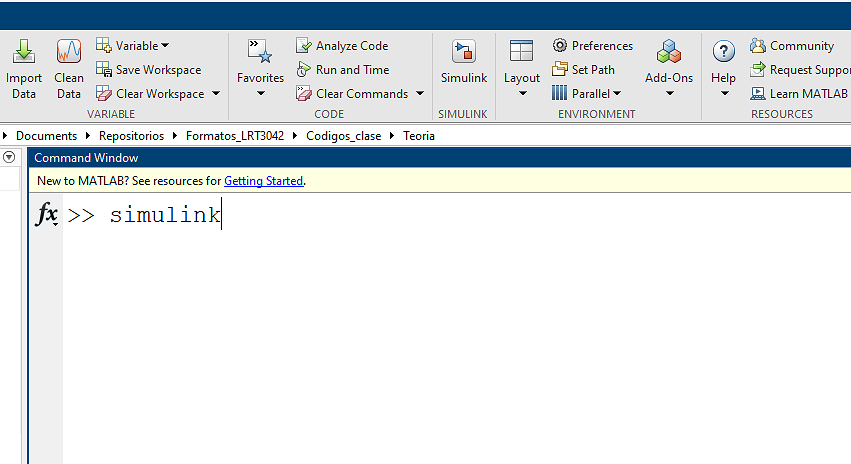
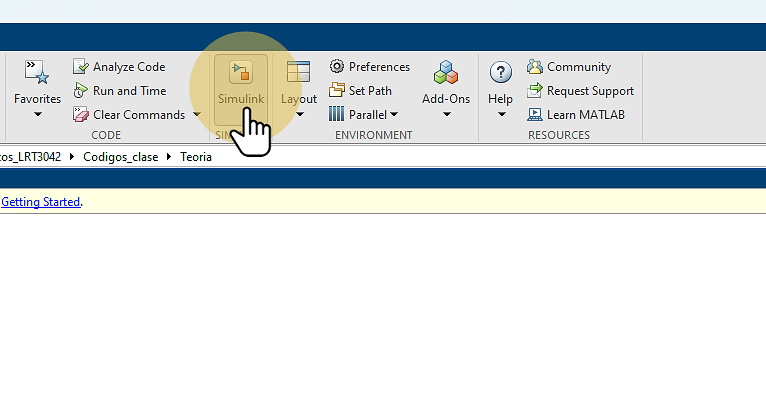
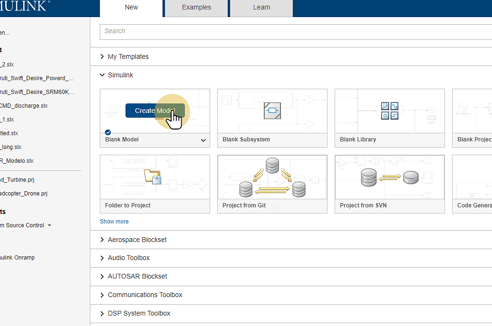
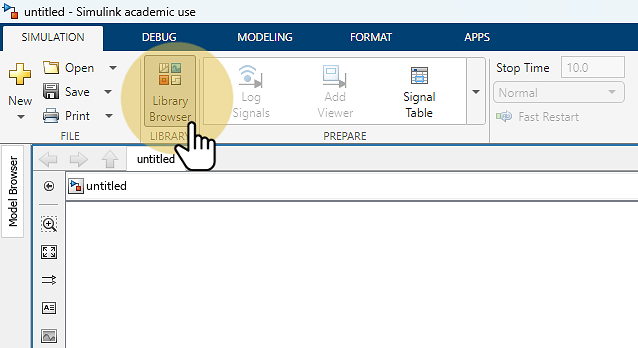
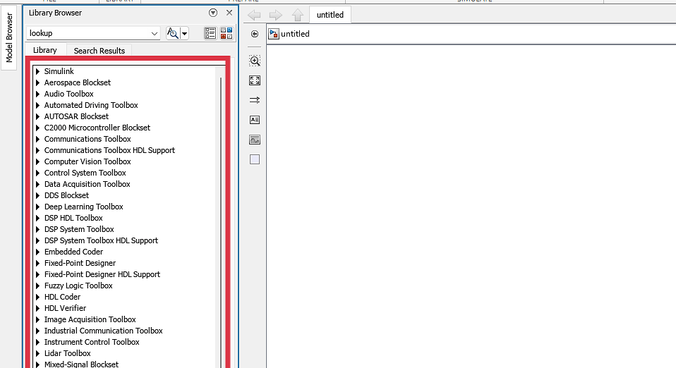
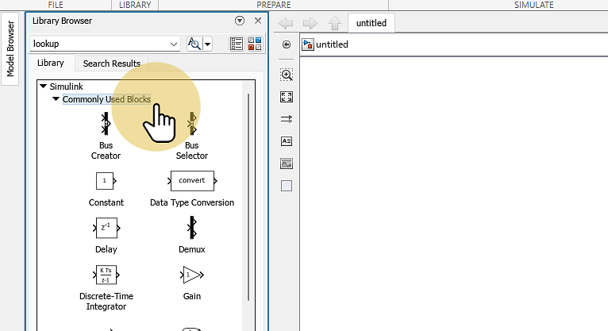
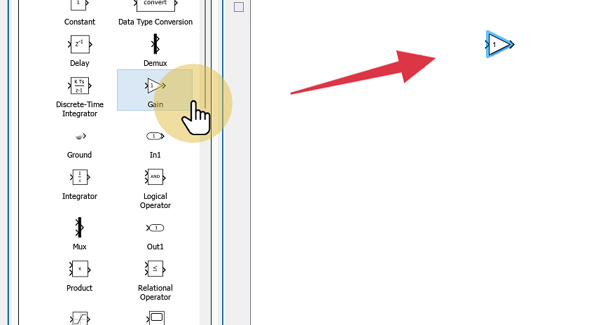
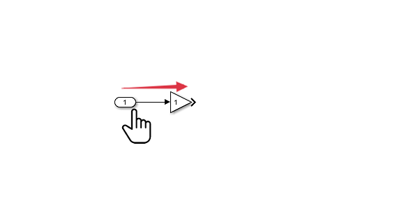

# Intro_a_Simulink
## ¿Qué es Simulink?
Simulink es un entorno de programación visual, el cual se encuentra dentro de Matlab.
Es ampliamente utilizado para analizar y simular sistemas lineales y no lineales, en tiempo continuo o en tiempo discreto.

El modelo a simular se construye mediante el uso de bloques, los archivos creados con Simulink tienen extensión *.mdl.

Simulink cuenta con librerias de bloques (Blocksets) de prácticamente todas las áreas de Ingeniería.

## Nuevo Modelo en Simulink

## Tabla de Contenido
1. [Abrir Simulink](#z-KOxsxKy1rTNQWzRm-p4)
2. [Abrir Simulink (2)](#U3SA-Ty6n-6_Z1qeCqsqD)
3. [Crear un Nuevo Modelo](#ZGZ2IfP0d2yP_H7-mdw43)
4. [Abrir Librerias Disponibles](#onrMfHBDhaK-Za8Hf8bLw)
5. [Bibliotecas disponibles](#O4CtIe66kGsNzpjHo8wG2)
6. [Abrir librería](#pbRwCULhI3uxaj-60PKJg)
7. [Agregar Bloque](#wlCdPhKXnTQKjmJ7JqA4q)
8. [Conectar componentes](#_mF98E3nCYNHfg5lZaog8)

### 1. Abrir Simulink 
Escribir simulink en la ventana Command Window y presionar Enter

### 2. Abrir Simulink (2) 
Dar Click en el ícono de Simulink que se encuentra en la parte superior de Matlab.

### 3. Crear un Nuevo Modelo 
Dar Click en "Create Model", en el recuadro Blank Model

### 4. Abrir Librerias Disponibles 
Dar Click en "Library Browser", esto abrirá la biblioteca principal con todos los bloques disponibles en su instalación de Matlab.

### 5. Bibliotecas disponibles 

### 6. Abrir librería 
Al dar click en alguna de las librerías disponibles, se abrirán las opciones de bloques de dicha librería. En este caso, Simulink => Commonly Used Blocks.

### 7. Agregar Bloque 
Arrastrar y soltar en el área de trabajo el componente a agregar

### 8. Conectar componentes 
Para conectar componentes, basta con dar click en la salida del bloque y arrastrar el mouse sin soltar a la entrada del siguiente bloque.

